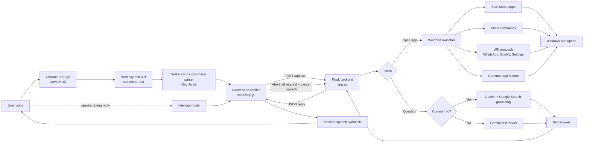

# Jarvis AI

A local Windows voice assistant with a Jarvis-style web interface. Jarvis can listen for "Hey Jarvis", answer questions with Google Gemini, use Google Search grounding for current facts, speak replies aloud, handle voice interruptions, and open installed Windows apps by voice.

## What It Can Do

- Wake by voice after you click `Enable Voice`.
- Answer questions using Gemini.
- Use Google Search grounding for current facts, news, office holders, scores, prices, and other date-sensitive questions.
- Speak answers aloud.
- Interrupt its own speech when you speak a new command.
- Open installed Windows apps, including Start Menu apps like WhatsApp.
- Show a Jarvis-inspired HUD with radar, signal, mode, wake-word, and interrupt status.

## Tech Stack

- Python 3.11+
- Flask
- Google Gemini API via `google-genai`
- Browser Web Speech API for microphone speech recognition
- Windows PowerShell app launching

## Architecture



Jarvis is split into two main layers:

- The browser handles the HUD, microphone permission, speech recognition, spoken replies, and interruption behavior.
- The Flask backend handles Gemini answers, Google Search grounding, command parsing, and Windows app launching.

## Setup

Clone or open the project:

```powershell
cd C:\Users\karthik\jarvis_AI
```

Create and activate a virtual environment:

```powershell
python -m venv .venv
.\.venv\Scripts\Activate.ps1
```

Install dependencies:

```powershell
pip install -r requirements.txt
```

Create a local `.env` file:

```env
GEMINI_API_KEY=your_gemini_api_key_here
JARVIS_MODEL=gemini-flash-latest
JARVIS_SEARCH_MODEL=gemini-2.5-flash
```

Run Jarvis:

```powershell
python app.py
```

Open:

```text
http://127.0.0.1:5000
```

Use Chrome or Edge for best voice support.

## How To Use

1. Open `http://127.0.0.1:5000`.
2. Click `Enable Voice`.
3. Allow microphone permission.
4. Say `Hey Jarvis`.
5. Ask a question or give an app command.

Examples:

```text
Hey Jarvis open WhatsApp
Hey Jarvis open calculator
Hey Jarvis explain recursion in one sentence
Hey Jarvis who is the current Chief Minister of Tamil Nadu?
```

## App Launching

Jarvis tries several Windows launch methods:

- Start Menu app search
- PATH commands
- Direct `Start-Process`
- Common installed app folders
- Known URI protocols such as WhatsApp, Telegram, Spotify, Discord, Settings, Mail, and Camera

If an app is installed and Windows exposes a launcher for it, Jarvis should be able to open it. If Windows blocks it or the app is not installed, Jarvis will report a failure.

## Models

The default model is:

```env
JARVIS_MODEL=gemini-flash-latest
```

This is chosen for quick voice replies.

Current information uses:

```env
JARVIS_SEARCH_MODEL=gemini-2.5-flash
```

That model is used with Google Search grounding for questions about current facts, news, office holders, scores, prices, and recent events.

Other model options:

- `gemini-flash-latest` for fast voice responses.
- `gemini-3-flash-preview` for newer Flash responses.
- `gemini-3.1-pro-preview` for stronger reasoning if your quota allows it.
- `gemini-pro-latest` to follow Google's current Pro alias if your quota allows it.

## Troubleshooting

### Voice does not work

- Use Chrome or Edge.
- Allow microphone permission.
- Check Windows microphone privacy settings.
- Refresh the page and click `Enable Voice` again.
- Brave may block or weaken the browser speech API, so Chrome or Edge is recommended.

### Answers are slow

- Normal questions use `gemini-flash-latest` for speed.
- Current/news questions use Google Search grounding and may take longer.
- Shorter questions usually return faster spoken replies.

### App does not open

- Confirm the app is installed.
- Try opening it manually from the Windows Start Menu once.
- Try saying the exact app name shown in Start Menu.
- Some apps require administrator privileges or do not expose a normal launcher.

### Gemini says quota exceeded

- Wait for quota reset, add billing, or switch `JARVIS_MODEL` to a lighter model.
- `gemini-flash-latest` is usually safer for daily voice usage than Pro preview models.

## Security Notes

- Keep `.env` private.
- Do not commit your Gemini API key.
- `.env` is ignored by git in this project.
- Jarvis runs locally on `127.0.0.1`.

## Development

Run tests:

```powershell
.\.venv\Scripts\python.exe -m pytest
```

Project structure:

```text
app.py                 Flask backend, Gemini calls, Windows app launcher
templates/index.html   Jarvis web UI
static/app.js          Voice recognition, speech, interruption behavior
static/styles.css      Jarvis HUD and radar styling
tests/test_app.py      Backend tests
requirements.txt       Python dependencies
```
